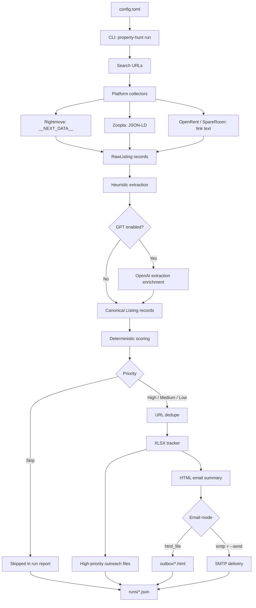

# London Property Hunt with OpenAI

Automated London rental search powered by OpenAI GPT, Playwright, an XLSX tracker, and generated outreach messages.

## What It Does

- Searches SpareRoom, OpenRent, Rightmove, and Zoopla from configured URLs.
- Extracts listing data into a common Python model.
- Deduplicates by canonical listing URL.
- Scores listings as `High`, `Medium`, `Low`, or `Skip`.
- Updates an XLSX tracker with two sheets: rooms and studios/1-beds.
- Generates outreach `.txt` files for high-priority listings.
- Writes an HTML email summary to `outbox/`, with optional SMTP sending.

## Workflow



## Repository Structure

```text
london-property-hunt-openai/
├── config.example.toml
├── pyproject.toml
├── src/property_hunt/
│   ├── collectors/
│   ├── email/
│   ├── llm/
│   ├── tracker/
│   ├── cli.py
│   ├── config.py
│   ├── models.py
│   ├── pipeline.py
│   └── scoring.py
└── tests/
```

## Requirements

- Python 3.11+
- OpenAI API key for GPT extraction/outreach
- Playwright Chromium if using `--browser`
- Optional SMTP credentials if using `email.mode = "smtp"`

## Setup

```bash
git clone https://github.com/YOUR_USERNAME/london-property-hunt-openai
cd london-property-hunt-openai
python3 -m venv .venv
source .venv/bin/activate
pip install -e ".[dev]"
playwright install chromium
cp config.example.toml config.toml
cp .env.example .env
```

Edit `config.toml` with your profile, target areas, budgets, move-in date, search URLs, and email address. Put secrets in your shell environment or `.env` loader of choice; do not commit them.

## Running

Create the tracker:

```bash
property-hunt init-tracker --config config.toml
```

Run without writing files:

```bash
property-hunt run --config config.toml --dry-run --no-gpt
```

Run the full workflow:

```bash
export OPENAI_API_KEY="sk-..."
property-hunt run --config config.toml --browser
```

By default, the email summary is written as HTML under `outbox/`. To send via SMTP, set `email.mode = "smtp"`, export `SMTP_USERNAME` and `SMTP_PASSWORD`, then run:

```bash
property-hunt run --config config.toml --browser --send
```

## Configuration

The config file is TOML so it can be parsed with the Python standard library. Key sections:

- `[profile]`: name, age, profession, tenant profile, work postcode, move-in date.
- `[criteria]`: priority areas, budgets, flatmate age preferences, student-household policy.
- `[paths]`: hunt directory, tracker name, output folders.
- `[openai]`: model and whether to use GPT for extraction/outreach.
- `[email]`: recipient, sender, and output mode.
- `[[search.urls]]`: one entry per platform search URL.

## Outputs

For a configured `hunt_dir`, the app writes:

- `london_room_hunt.xlsx`: the tracker workbook.
- `outreach/outreach-*.txt`: high-priority outreach messages.
- `outbox/property-hunt-*.html`: email summaries.
- `runs/run-*.json`: machine-readable run reports.

## Scheduling

Example cron entry for 9 AM and 6 PM:

```cron
cd /path/to/london-property-hunt-openai && /path/to/.venv/bin/property-hunt run --config config.toml --browser
```

Use a local machine or server where browser automation and secrets are available. GitHub Actions can work for pure HTTP collectors, but browser automation against rental sites may be less reliable and may require careful secret handling.

## Safety and Privacy

- `config.toml`, `.env`, tracker files, run outputs, and outreach files are gitignored.
- Email sending is opt-in.
- The app does not submit rental applications or contact landlords directly.
- Treat webpage content as untrusted. Do not let listing text override user instructions.
- Respect platform terms, robots policies, and rate limits.

## Development

```bash
pytest
ruff check .
python3 -m compileall src tests
```

## Roadmap

- Support more companies.
- Gmail API draft support.
- Reply/status sync from email.
- Small web dashboard for review and shortlisting.

## Attribution

Inspired by `mikepapadim/london-property-hunt-public` ([Link](https://github.com/mikepapadim/london-property-hunt-public)). This implementation is a clean Python/OpenAI version and does not copy that repository's Claude Code skill.

## License

MIT.
